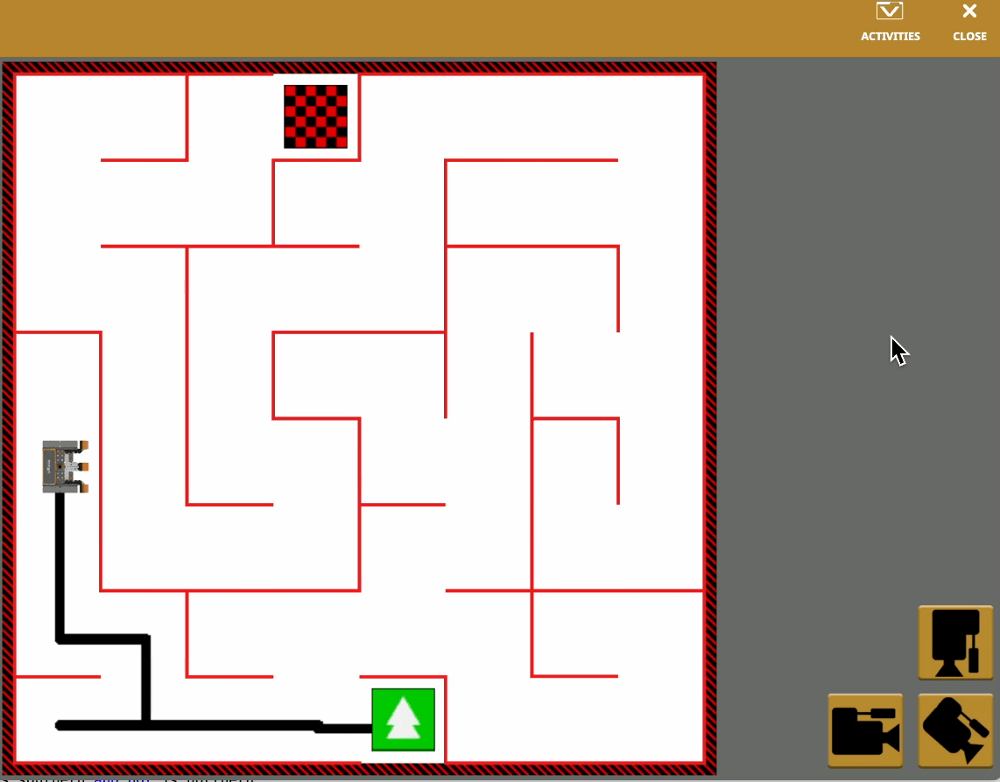
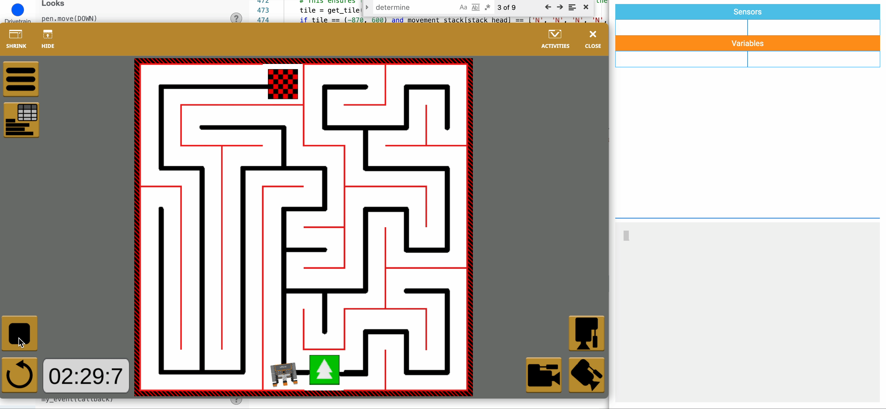
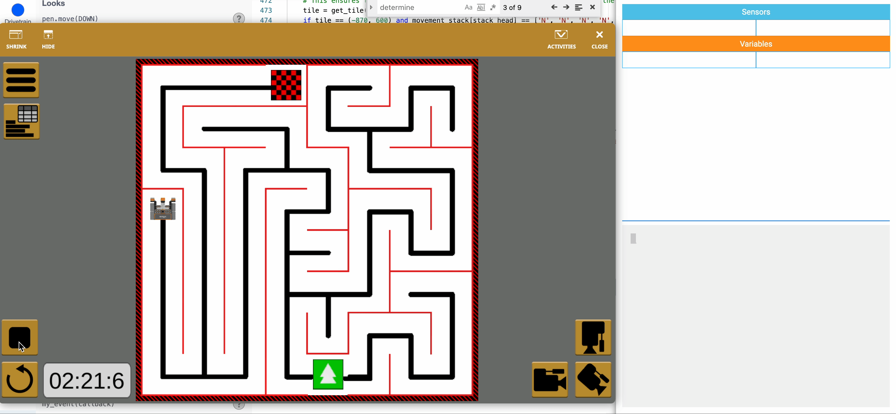

# robotics-assignment-1

##  Basic Requirements

### Move along the corridors without straying past the walls.

### Find its way out of the maze and use the quickest route

## Advanced Requirements

### Find the quickest way out of the maze

This is demonstrated in the previous clip.

### Map the maze

### Return back home

## Video demonstration link

