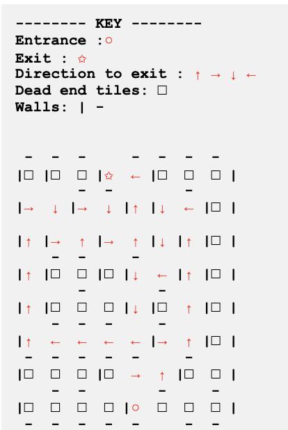

# robotics-assignment-1

Codebase for the application can be found in main.py in this repo.

##  Basic Requirements

### Move along the corridors without straying past the walls.


### Find its way out of the maze and use the quickest route


## Advanced Requirements

### Find the quickest way out of the maze

This is demonstrated in the previous clip (see above).

### Map the maze

*** Demo of mapping output:


*** map output (visual):



*** map output (data):

```python
[((-870, 850), {'visited': True, 'walls': ['N', 'W', 'E'], 'key_tile': '□ '}), ((-620, 850), {'visited': True, 'walls': ['N', 'W'], 'key_tile': '□ '}), ((-370, 850), {'visited': True, 'walls': ['E', 'N', 'S'], 'key_tile': '□ '}), ((-120, 850), {'visited': True, 'walls': ['W', 'S'], 'key_tile': '✩ '}), ((130, 850), {'visited': True, 'walls': ['N', 'E'], 'key_tile': '← '}), ((380, 850), {'visited': True, 'walls': ['N', 'W'], 'key_tile': '□ '}), ((630, 850), {'visited': True, 'walls': ['N', 'S'], 'key_tile': '□ '}), ((880, 850), {'visited': True, 'walls': ['E', 'N'], 'key_tile': '□ '})]
[((-870, 600), {'visited': True, 'walls': ['W'], 'key_tile': '→ '}), ((-620, 600), {'visited': True, 'walls': ['E'], 'key_tile': '↓ '}), ((-370, 600), {'visited': True, 'walls': ['N', 'W'], 'key_tile': '→ '}), ((-120, 600), {'visited': True, 'walls': ['E', 'N'], 'key_tile': '↓ '}), ((130, 600), {'visited': True, 'walls': ['W', 'E'], 'key_tile': '↑ '}), ((380, 600), {'visited': True, 'walls': ['W'], 'key_tile': '↓ '}), ((630, 600), {'visited': True, 'walls': ['N', 'E'], 'key_tile': '← '}), ((880, 600), {'visited': True, 'walls': ['E', 'W'], 'key_tile': '□ '})]
[((-870, 350), {'visited': True, 'walls': ['W', 'E'], 'key_tile': '↑ '}), ((-620, 350), {'visited': True, 'walls': ['S', 'W'], 'key_tile': '→ '}), ((-370, 350), {'visited': True, 'walls': ['E', 'S'], 'key_tile': '↑ '}), ((-120, 350), {'visited': True, 'walls': ['W'], 'key_tile': '→ '}), ((130, 350), {'visited': True, 'walls': ['E', 'S'], 'key_tile': '↑ '}), ((380, 350), {'visited': True, 'walls': ['E', 'W'], 'key_tile': '↓ '}), ((630, 350), {'visited': True, 'walls': ['W', 'E'], 'key_tile': '↑ '}), ((880, 350), {'visited': True, 'walls': ['E', 'W'], 'key_tile': '□ '})]
[((-870, 100), {'visited': True, 'walls': ['W', 'E'], 'key_tile': '↑ '}), ((-620, 100), {'visited': True, 'walls': ['N', 'W'], 'key_tile': '□ '}), ((-370, 100), {'visited': True, 'walls': ['E', 'N', 'S'], 'key_tile': '□ '}), ((-120, 100), {'visited': True, 'walls': ['E', 'W'], 'key_tile': '□ '}), ((130, 100), {'visited': True, 'walls': ['W', 'N'], 'key_tile': '↓ '}), ((380, 100), {'visited': True, 'walls': ['S', 'E'], 'key_tile': '← '}), ((630, 100), {'visited': True, 'walls': ['W', 'E'], 'key_tile': '↑ '}), ((880, 100), {'visited': True, 'walls': ['E', 'W'], 'key_tile': '□ '})]
[((-870, -150), {'visited': True, 'walls': ['W', 'E'], 'key_tile': '↑ '}), ((-620, -150), {'visited': True, 'walls': ['W', 'S'], 'key_tile': '□ '}), ((-370, -150), {'visited': True, 'walls': ['S', 'N'], 'key_tile': '□ '}), ((-120, -150), {'visited': True, 'walls': ['S', 'E'], 'key_tile': '□ '}), ((130, -150), {'visited': True, 'walls': ['E', 'W'], 'key_tile': '↓ '}), ((380, -150), {'visited': True, 'walls': ['W', 'S', 'N'], 'key_tile': '□ '}), ((630, -150), {'visited': True, 'walls': ['E'], 'key_tile': '↑ '}), ((880, -150), {'visited': True, 'walls': ['E', 'W'], 'key_tile': '□ '})]
[((-870, -400), {'visited': True, 'walls': ['W', 'S'], 'key_tile': '↑ '}), ((-620, -400), {'visited': True, 'walls': ['S', 'N'], 'key_tile': '← '}), ((-370, -400), {'visited': True, 'walls': ['S', 'N'], 'key_tile': '← '}), ((-120, -400), {'visited': True, 'walls': ['S', 'N'], 'key_tile': '← '}), ((130, -400), {'visited': True, 'walls': ['S', 'E'], 'key_tile': '← '}), ((380, -400), {'visited': True, 'walls': ['N', 'W'], 'key_tile': '→ '}), ((630, -400), {'visited': True, 'walls': ['E', 'S'], 'key_tile': '↑ '}), ((880, -400), {'visited': True, 'walls': ['E', 'W'], 'key_tile': '□ '})]
[((-870, -650), {'visited': True, 'walls': ['N', 'W'], 'key_tile': '□ '}), ((-620, -650), {'visited': True, 'walls': ['N', 'S'], 'key_tile': '□ '}), ((-370, -650), {'visited': True, 'walls': ['E', 'N', 'S'], 'key_tile': '□ '}), ((-120, -650), {'visited': True, 'walls': ['W', 'N'], 'key_tile': '□ '}), ((130, -650), {'visited': True, 'walls': ['N'], 'key_tile': '→ '}), ((380, -650), {'visited': True, 'walls': ['E', 'S'], 'key_tile': '↑ '}), ((630, -650), {'visited': True, 'walls': ['W', 'N'], 'key_tile': '□ '}), ((880, -650), {'visited': True, 'walls': ['S', 'E'], 'key_tile': '□ '})]
[((-870, -900), {'visited': True, 'walls': ['W', 'S'], 'key_tile': '□ '}), ((-620, -900), {'visited': True, 'walls': ['S', 'N'], 'key_tile': '□ '}), ((-370, -900), {'visited': True, 'walls': ['S', 'N'], 'key_tile': '□ '}), ((-120, -900), {'visited': True, 'walls': ['S', 'E'], 'key_tile': '□ '}), ((130, -900), {'visited': True, 'walls': ['S', 'W'], 'key_tile': '○ '}), ((380, -900), {'visited': True, 'walls': [], 'key_tile': '□ '}), ((630, -900), {'visited': True, 'walls': ['S', 'W'], 'key_tile': '□ '}), ((880, -900), {'visited': True, 'walls': ['E', 'N', 'S'], 'key_tile': '□ '})]
```

### Return back home


## Video demonstration can be found on youtube as video is to large for the repo:

[Robotics Assignment 1 video demonstration](https://youtu.be/qOKvc4E8V1M)
